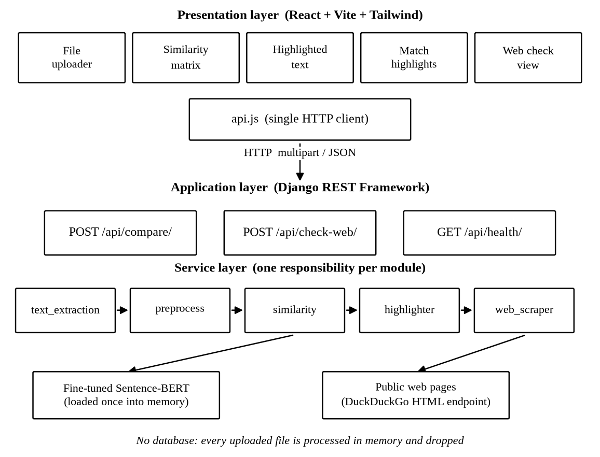
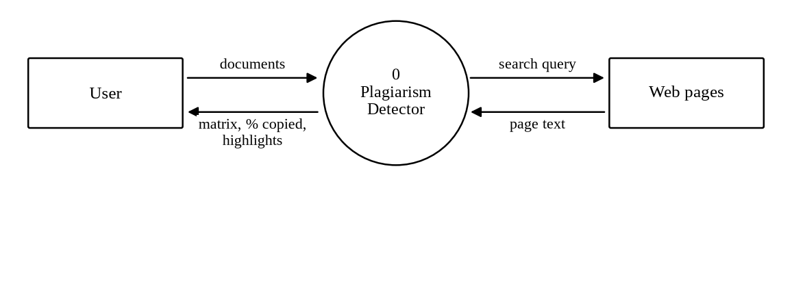
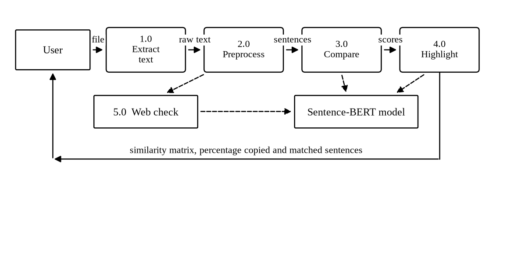
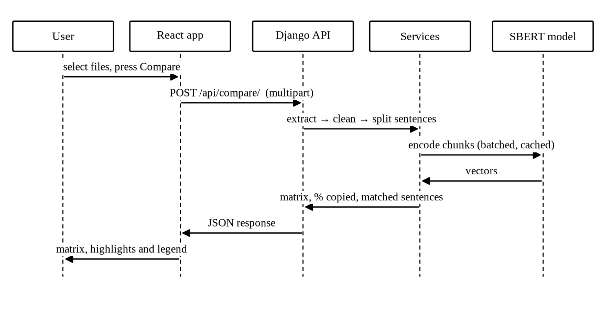
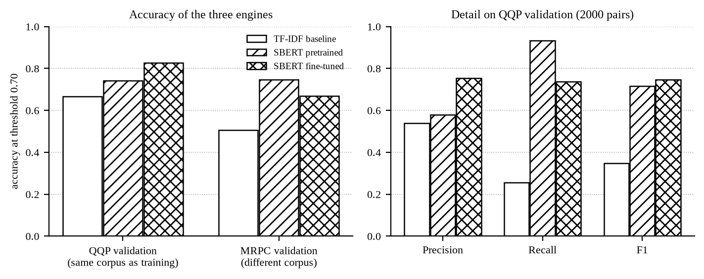
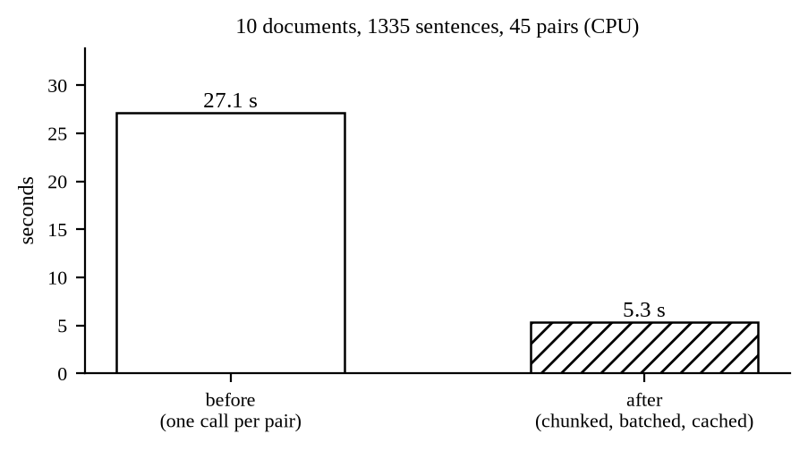
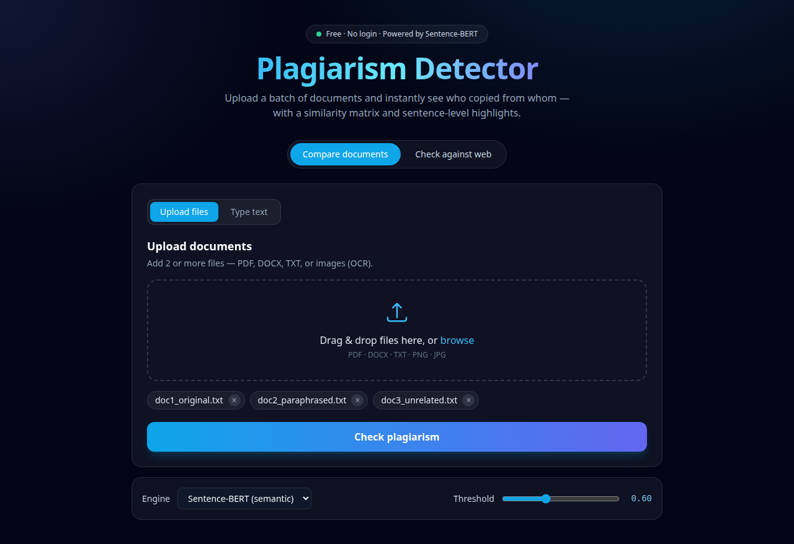
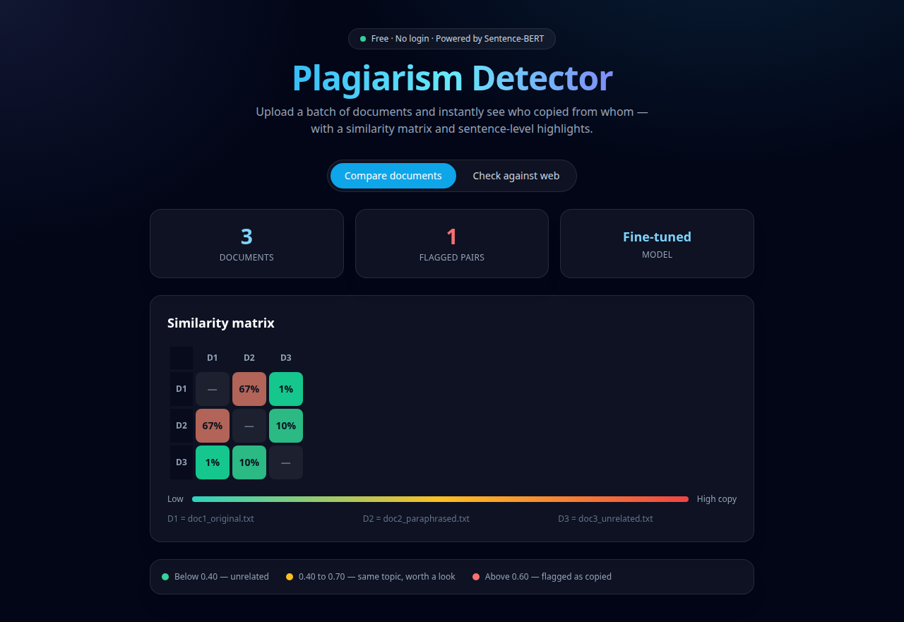
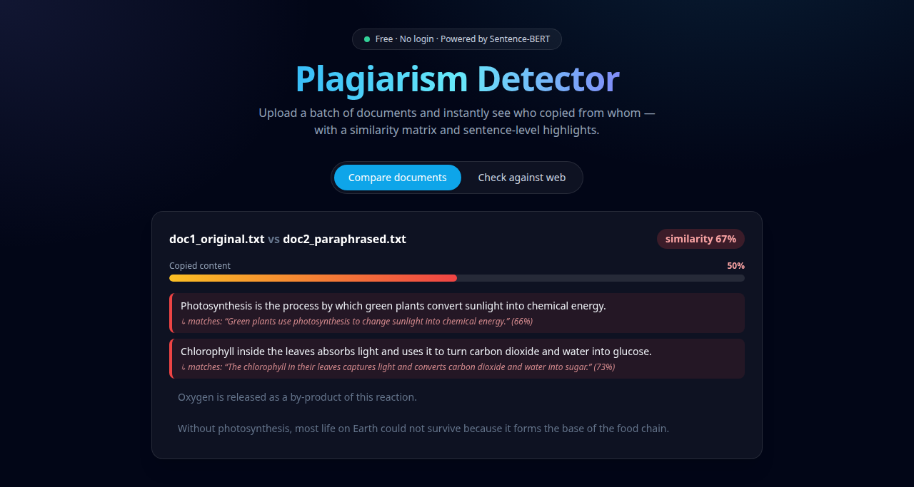
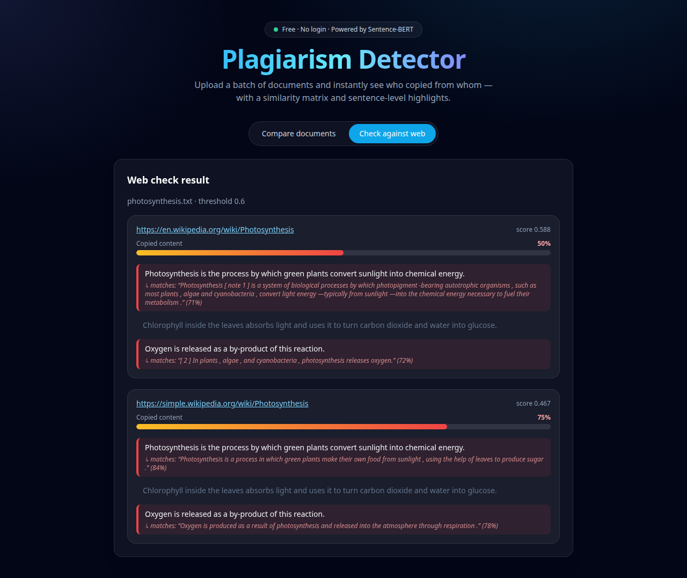

# Plagiarism Detector — Project Guide for the Defence

Project II · Gandaki College of Engineering and Science
Supervisor: Er. Prativa Nyaupane
Neon Neupane (TL) · Bishal Acharya (M1) · Nabin Giri (M2)

One document for the three of us. It follows the system from the upload to the screen, so
whatever part you built, you can explain the whole flow. Read it end to end once; then
learn your own sections properly.

---

## Who studies what

The split follows the Division of Work in the report and the minutes. Every section title
carries its owner. **Sections 1, 2, 4, 8, 9, 11 and 12 are for everybody** — the opening,
the flow, the results, the demo, the weak points and the numbers can be asked of whoever is
standing there.

| Member | Built | Owns sections |
|---|---|---|
| Neon Neupane | Django and the three endpoints, extraction and OCR, preprocessing and Devanagari, the batching and sentence cache, error handling, the service wiring, the tests and the user manual | 3, 5.1, 5.2, 6.4, 7.1, 7.2, 7.4, 10.2, 10.4 |
| Bishal Acharya | Sentence-BERT selection and fine-tuning, the TF-IDF baseline in PyTorch, both engines, the highlighting logic, the web scraping check, the evaluation | 5.3, 5.4, 5.5, 6.1, 6.2, 6.3, 6.5, 6.6, 10.1 |
| Nabin Giri | The whole React and Vite frontend: uploader, matrix, highlight views, web check view, engine and threshold controls, responsive layout | 7.2, 7.3, 7.5, 10.3 |
| All three | The dataset work: comparing the corpora, QQP and MRPC, the sample documents, the Nepali text and the scans | 1, 2, 4, 8, 9, 11, 12 |

---

## 1. The project in sixty seconds  ·  everybody

> The tools students can reach today either cost money or compare words. A word comparison
> is defeated by changing a few words. Our system compares the **meaning** of sentences
> instead, using a Sentence-BERT model we fine-tuned ourselves, so a paraphrase is still
> caught. It does two checks — documents against each other, and one document against the
> web — and it marks the copied sentences inside the document, so the result can be
> verified by eye rather than trusted.

If you say nothing else, say that.

---

## 2. What the system does  ·  everybody

The system answers two questions about a document.

1. **Did these documents copy from each other?** A batch is uploaded, every document is
   compared against every other, and the result is a similarity matrix plus the list of
   matching sentences.
2. **Was this document copied from the web?** One document is uploaded, the system searches
   the web, opens the result pages and compares the document against them.

Nothing is stored. A file is read in memory, used for the comparison, and dropped when the
response is sent. Django configures a database; the application never writes to it.

---

## 3. System architecture  ·  **Neon**



Three layers, one direction of dependency. The browser talks to the API, the API talks to
the services, the services talk to the model and to the web.

| Layer | Technology | Responsibility |
|---|---|---|
| Presentation | React 18, Vite, Tailwind CSS | Upload, settings, matrix, highlights |
| API | Django, Django REST Framework | Parse the request, call a service, return JSON |
| Service | Python modules in `detector/services` | Extraction, preprocessing, similarity, highlighting, scraping |
| Model | Sentence-BERT and TF-IDF, both PyTorch | Turn text into vectors and compare them |

The views are deliberately thin — `views.py` opens with *"HTTP layer -- thin. Views only
parse the request, call a service, return JSON."* No similarity logic lives in a view, so
every service is testable without starting Django, which is what `backend/tests/` does.

```
backend/
  config/          Django project: settings, urls, wsgi
  detector/
    views.py       CompareView, WebCheckView, HealthView
    urls.py        /api/compare/, /api/check-web/, /api/health/
    services/
      text_extraction.py   file bytes  -> plain text
      preprocess.py        text        -> clean text, tokens, sentences, keywords
      similarity.py        texts       -> n x n similarity matrix
      highlighter.py       two texts   -> matched sentences + % copied
      web_scraper.py       text        -> scored web sources
    models/plagiarism-sbert/   the fine-tuned checkpoint (created by train.py)
  tests/           unit tests for extraction, preprocessing, similarity
frontend/
  src/api.js       the only file that talks to the backend
  src/App.jsx      tabs, settings, result layout
  src/components/  FileUploader, SimilarityMatrix, HighlightedText,
                   MatchHighlights, WebCheck
train.py           one command fine-tuning, saves the checkpoint
```

---

## 4. The end-to-end flow  ·  everybody

**This is the section to know cold.** Whatever you built, you should be able to walk the
panel from the upload to the screen.

### 4.1 The chain

```
upload -> extract -> preprocess -> embed -> compare -> highlight -> JSON response
```

Nothing is written to a data store at any step. That is why the level 1 diagram below has
no store in it — the point the supervisor asked us to make explicit.





### 4.2 One request, step by step



1. **Browser.** Files are dropped on `FileUploader`. The engine and threshold come from the
   settings row. `handleCompare()` sets `loading` and calls `compareDocuments()`.
   *(Nabin's part)*
2. **Transport.** `api.js` builds a `FormData` and posts it to `/api/compare/`. Vite
   forwards it to Django on port 8000. *(Nabin and Neon)*
3. **View.** `CompareView.post()` runs `_collect_documents()`. Each file goes to
   `extract_text()`; a failure is recorded in `skipped` instead of raising. *(Neon)*
4. **Guard.** Fewer than two readable documents, or a `method` other than `sbert`/`tfidf`,
   returns `400` with a `detail` message. *(Neon)*
5. **Matrix.** `similarity.all_pairs_matrix(texts, method)`. For SBERT: chunk each document
   into groups of five sentences, embed all chunks of all documents in **one** batched call,
   average the chunks per document, cosine-compare every pair. *(Bishal, with Neon's batching)*
6. **Highlights.** For every pair at or above the threshold,
   `highlighter.compare_documents()` embeds the sentences of both documents — hitting the
   cache filled in step 5 — takes the best match for each sentence of A, and computes
   `percent_copied`. *(Bishal)*
7. **Response.** The view returns the matrix, the flagged pairs, the threshold, the skipped
   files, and whether the fine-tuned model is loaded. *(Neon)*
8. **Render.** `App.jsx` stores it. `SimilarityMatrix` draws the table, `HighlightedText`
   draws the sentence pairs, the stat cards show the counts. The uploaded bytes are already
   gone from the server. *(Nabin)*

---

## 5. The five services

### 5.1 Text extraction  ·  **Neon**

An uploaded file becomes plain text. The extension picks the extractor from a lookup table,
so a new format is one function plus one dictionary entry.

| Type | Extensions | How it is read |
|---|---|---|
| Text | `.txt`, `.md` | Decoded as UTF-8, errors ignored |
| Word | `.docx` | `python-docx`, paragraph text |
| PDF | `.pdf` | `pdfplumber`; if there is no text layer, the pages are rendered and sent to OCR |
| Image | `.png`, `.jpg`, `.jpeg`, `.bmp`, `.tiff` | Tesseract OCR |

Three decisions worth explaining:

- **A scanned PDF is detected, not rejected.** If the text layer is empty the file is a
  scan, so `_ocr_pdf` renders each page at 200 dpi and runs Tesseract.
- **The OCR language is resolved from what is installed.** `ocr_lang()` asks Tesseract which
  languages it has: `eng+nep` if the Nepali data is present, otherwise `eng`. `OCR_LANG`
  overrides it.
- **Every failure is a message, never a 500.** Any exception leaves as `ValueError` with a
  sentence written for the user, and the view keeps the failed file in `skipped` with its
  reason instead of dropping it silently.

### 5.2 Preprocessing  ·  **Neon**

Four pure functions.

- `clean()` — lowercase, collapse whitespace.
- `tokenize()` — words of two or more characters matching `[a-z0-9ऀ-ॿ]`, stopwords removed.
  The character class covers the Devanagari block, so Nepali words survive.
- `split_sentences()` — splits on `.`, `!`, `?` and on the danda `।` and double danda `॥`.
  A danda with no space after it is handled by a second split. Fragments of ten characters
  or fewer are dropped.
- `keywords(text, k=6)` — the six most frequent content words of four or more characters;
  this builds the web search query.

The stopword list carries English *and* Nepali function words (`र`, `मा`, `को`, `छ`,
`हुन्छ`, …) for the same reason: frequent, meaningless, and they would dominate a TF-IDF vector.

### 5.3 Similarity engines  ·  **Bishal**

Two engines behind one function, `all_pairs_matrix(texts, method)`. Both are built on
PyTorch tensors — scikit-learn is deliberately not used, so the vector arithmetic is visible.

**TF-IDF (the baseline).** Builds a vocabulary, computes a smoothed inverse document
frequency

```
idf(t) = log((1 + N) / (1 + df(t))) + 1
```

then a term-frequency vector divided by document length and multiplied by the idf. It
cannot see a paraphrase — it only sees shared words — and it is in the system precisely to
show that.

**Sentence-BERT (the real one).** Section 6.

Both end at `_cosine_matrix`, which L2-normalises the rows and multiplies the matrix by its
own transpose, clamped to `[-1, 1]`.

### 5.4 Highlighting  ·  **Bishal**

`compare_documents(a, b, threshold)` turns one number into something a person can check.

1. Split both documents into sentences.
2. Embed every sentence of A and of B.
3. Full cosine matrix between them with `util.cos_sim`.
4. For each sentence of A take its best match in B; at or above the threshold it is marked
   copied and the matching sentence is attached.
5. `percent_copied = 100 × copied sentences / total sentences of A`.

The percentage is a **count of sentences, not an average of scores** — which is what makes
it defensible: every point of it can be pointed at on screen.

### 5.5 Web checking  ·  **Bishal**

1. `keywords()` produces a six-word query.
2. It is posted to the DuckDuckGo HTML endpoint — no API key, no quota.
3. Up to ten result pages are opened; `script`, `style`, `nav`, `header`, `footer` are
   stripped, the `<p>` text is joined and cut to 5000 characters.
4. Page and document are embedded and compared, and the sentence highlighting is run.
5. **A page with zero copied sentences is discarded.** A high document score alone is
   topical overlap, not plagiarism.
6. Survivors are sorted by score, highest first.

Every network call is inside a `try`. A search failure returns an empty list, a page that
will not load is skipped, and the request still answers — which is why the demo survives a
bad network.

---

## 6. How the model works  ·  **Bishal**



### 6.1 The idea

*"The cat sat on the mat"* and *"The feline rested upon the rug"* share almost no words, so
a string checker scores them near zero although one is a rewrite of the other.

Sentence-BERT maps a sentence to a 384-dimensional vector, trained so that sentences with
the same meaning land close together. The comparison is the cosine of the angle between them:

```
similarity(a, b) = (a · b) / (|a| × |b|)
```

The value runs from -1 to 1. Above **0.7**, the pair is flagged.

### 6.2 The base model and the fine-tuning

Base: `all-MiniLM-L6-v2` — six transformer layers, 384 dimensions, small enough for a
laptop CPU. `train.py` fine-tunes it:

| Setting | Value |
|---|---|
| Dataset | Quora Question Pairs, about 364,000 labelled pairs |
| Pairs used | 30,000 |
| Epochs | 1 |
| Batch size | 32 |
| Loss | `CosineSimilarityLoss` |
| Warm-up | 10% of steps |
| Held out | 10% for evaluation |
| Output | `backend/detector/models/plagiarism-sbert` |

`CosineSimilarityLoss` pushes the cosine of a similar pair towards 1 and of a dissimilar
pair towards 0 — exactly the quantity the detector uses at runtime, so the model is trained
on the measure it is judged by.

The backend picks the checkpoint up on its own: `SbertEngine.get_model()` loads
`models/plagiarism-sbert` if it exists and falls back to pretrained otherwise.
`/api/health/` reports which one is live, and the interface shows **Fine-tuned** or
**Pretrained** on a stat card.

### 6.3 From a document to one vector

A transformer has a fixed input window, so a long document does not fit and feeding it
whole silently truncates the tail. `chunk_text()` splits the document into chunks of **five
sentences**, every chunk is embedded, and the document vector is the **mean of the chunk
vectors**. Nothing is dropped.

### 6.4 The two speed optimisations  ·  **Neon**

The eighth meeting reported that a large batch was slow. Two changes fixed it.

- **Batched encoding.** All chunks of *all* documents go into one
  `model.encode(..., batch_size=32)` call, sliced back per document. The model is entered
  once per request instead of once per document.
- **A sentence cache.** The same sentence appears in many pairs of an *n × n* matrix.
  `SbertEngine._cache` maps a string to its vector, so each sentence is encoded once per
  request. Capped at 4096 entries.



10 documents, 2628 words each, 1335 sentences, 45 highlighted pairs: **27.1 s → 5.3 s, a
5.1× speed-up on CPU**, with no change to the output.

### 6.5 Measured accuracy

QQP, 2000 held-out pairs, 692 positive, threshold 0.7:

| Engine | Accuracy | Precision | Recall | F1 | Seconds |
|---|---|---|---|---|---|
| TF-IDF baseline | 0.667 | 0.538 | 0.256 | 0.347 | 0.3 |
| SBERT pretrained | 0.743 | 0.580 | 0.932 | 0.715 | 19.1 |
| **SBERT fine-tuned** | **0.826** | **0.754** | 0.737 | **0.746** | 6.1 |

The number that matters most is **separation** — the gap between the mean score of a
plagiarised pair and of an unrelated pair:

| Engine | Mean positive | Mean negative | Separation |
|---|---|---|---|
| TF-IDF | 0.537 | 0.334 | 0.203 |
| SBERT pretrained | 0.866 | 0.556 | 0.310 |
| **SBERT fine-tuned** | 0.779 | 0.331 | **0.448** |

The pretrained model scores *everything* high — 0.556 even on unrelated pairs — so one
threshold works badly for it. Fine-tuning pushes unrelated pairs down to 0.331 and leaves
plagiarised ones at 0.779, which is what makes a fixed 0.7 usable.

### 6.6 The threshold

0.7 was fixed experimentally on the sample documents. It is a default, not a constant: the
interface exposes a slider from 0.40 to 0.95, the value travels with the request, and the
API clamps whatever arrives to `[0.1, 0.99]`.

---

## 7. Frontend and backend connection  ·  **Nabin and Neon**

### 7.1 The contract  ·  **Neon**

| Method | Path | Purpose |
|---|---|---|
| `GET` | `/api/health/` | Liveness, and whether the fine-tuned model is loaded |
| `POST` | `/api/compare/` | Compare a batch of documents against each other |
| `POST` | `/api/check-web/` | Compare one document against web pages |

No authentication — `DEFAULT_AUTHENTICATION_CLASSES` is empty and the permission class is
`AllowAny`. Nothing is stored and there are no accounts, so there is nothing to protect.

### 7.2 How the two servers meet  ·  **Nabin and Neon**

Vite runs on **5173**, Django on **8000**. They are joined two independent ways.

**A Vite proxy** — the browser only calls its own origin, so the request is same-origin:

```js
server: { port: 5173, proxy: { '/api': 'http://localhost:8000' } }
```

**CORS headers** — `CorsMiddleware` runs first with `CORS_ALLOW_ALL_ORIGINS = True`, so the
API also answers a direct cross-origin call, which is useful when testing with `curl`.

Because `api.js` uses the relative base `'/api'`, the same build works in both situations.

### 7.3 One place talks to the backend  ·  **Nabin**

`frontend/src/api.js` is the only frontend file that knows the backend exists. It holds one
`post()` helper that unwraps the error body, so a failure reaches the interface as the
API's `detail` string rather than a status code.

```js
const BASE = '/api'

export async function compareDocuments(files, method = 'sbert', threshold) {
  const form = new FormData()
  for (const file of files) form.append('files', file)
  form.append('method', method)
  if (threshold != null) form.append('threshold', threshold)
  return post('/compare/', form, true)
}
```

Files go as `multipart/form-data`, pasted text as JSON. Both work because the views declare
`parser_classes = [MultiPartParser, FormParser, JSONParser]` and `_collect_documents()`
reads uploads and pasted items into the same `[{name, text}]` list.

### 7.4 Request and response  ·  **Neon**

`POST /api/compare/` — multipart: `files` (repeated), `method`, `threshold`. Response:

```json
{
  "documents": ["doc1_original.txt", "doc2_paraphrased.txt"],
  "method": "sbert",
  "model_fine_tuned": true,
  "threshold": 0.7,
  "matrix": [[1.0, 0.6676], [0.6676, 1.0]],
  "flagged_pairs": [
    {
      "doc_a": "doc1_original.txt",
      "doc_b": "doc2_paraphrased.txt",
      "score": 0.6676,
      "percent_copied": 25.0,
      "matches": [
        { "sentence": "...", "matched_with": "...", "score": 0.81, "copied": true }
      ]
    }
  ],
  "skipped": [{ "name": "broken.pdf", "error": "The file could not be read (PdfError)." }]
}
```

`skipped` is what keeps a bad upload visible. Errors are `400` with a `detail` string:
fewer than two readable documents, or an unknown `method`.

### 7.5 Which component draws what  ·  **Nabin**

| Field | Component | What it draws |
|---|---|---|
| `documents`, `matrix` | `SimilarityMatrix.jsx` | The *n × n* table, coloured by band |
| `flagged_pairs` | `HighlightedText.jsx`, `MatchHighlights.jsx` | Sentence pairs, copied ones marked |
| `sources` | `WebCheck.jsx` | Each page with its link, score and percentage |
| `skipped` | `App.jsx` | The amber "some files were skipped" panel |
| `model_fine_tuned` | `App.jsx` | The **Fine-tuned / Pretrained** stat card |
| `threshold` | `App.jsx` | The score legend bands |

`App.jsx` holds the state — `files`, `result`, `loading`, `error`, `method`, `threshold` —
and passes it down. No state library; the tree is shallow enough for `useState`.

---

## 8. Results  ·  everybody

The four sample documents, run through both engines:

| Pair | TF-IDF | SBERT fine-tuned | Verdict |
|---|---|---|---|
| `doc1_original` vs `doc2_paraphrased` | **0.468** — missed | **0.668** — caught | 25% copied, 1 of 4 sentences |
| `doc1_original` vs `doc3_unrelated` | 0.000 | 0.006 | Correctly ignored |
| `doc1_original` vs `doc4_nepali` | 0.000 | -0.018 | Correctly ignored |

That first row is the whole project in one line: the baseline misses the paraphrase, the
fine-tuned model catches it, and the unrelated pairs stay near zero so it is clearly not
just flagging everything.

---

## 9. Demo  ·  everybody



Start both servers and check the backend **before** demonstrating anything:

```bash
cd backend && python manage.py runserver     # http://localhost:8000
cd frontend && npm run dev                   # http://localhost:5173

curl http://localhost:8000/api/health/
# {"status": "ok", "model_fine_tuned": true}
```

If `model_fine_tuned` is `false` the checkpoint is missing and the numbers below will differ.

| # | Do | Say |
|---|---|---|
| 1 | Upload the four samples, engine **TF-IDF**, compare | "This is what a word-based checker does. The paraphrase scores 0.468 — below threshold. Missed." |
| 2 | Switch to **Sentence-BERT**, compare again | "Same files, meaning-based model. 0.668 — caught, 25% copied." |
| 3 | Open the sentence panel | "The percentage is a count of matched sentences, so you can check it yourself." |
| 4 | Point at the unrelated and Nepali rows | "0.006 and -0.018. It is not flagging everything — it separates." |
| 5 | Drag the threshold to 0.65 | "The threshold is a policy choice sent with each request, not a constant." |
| 6 | **Check against web** tab, paste a paragraph, run | "Sources come back scored and sorted. Pages sharing no sentence are dropped." |
| 7 | Upload a corrupt file with two good ones | "The bad file is named with its reason and the rest still compares. Nothing crashes." |







**If it breaks**, say what is happening and move on — never debug silently in front of the panel.

| Symptom | Fix on the spot |
|---|---|
| `model_fine_tuned: false` | Say the numbers shown are the pretrained model's; the comparison still works |
| Web check returns nothing | The endpoint is rate-limited; pass explicit URLs, the API accepts a `urls` list |
| First request hangs a few seconds | The model is loading — it is a singleton, the next request is fast |
| A scan returns no text | Tesseract missing or the scan is poor; switch to a text file |
| Nepali OCR is gibberish | The `nep` traineddata is not installed on this machine |

---

## 10. Questions to expect

### 10.1 About the model  ·  **Bishal**

**How does the system decide a sentence is copied?** Both sentences become 384-dimensional
vectors. We take the cosine of the angle between them; at or above 0.7 the sentence is
marked copied. The threshold was fixed experimentally and is adjustable in the interface.

**Why Sentence-BERT and not TF-IDF?** TF-IDF compares words. A paraphrase shares few words,
so it scores 0.468 on our pair — under threshold, missed. Sentence-BERT compares meaning and
scores the same pair 0.668. We kept TF-IDF as a selectable baseline so the difference can be
shown, not just claimed.

**What did fine-tuning actually improve?** Separation. The pretrained model averages 0.556
even on unrelated pairs, so no single threshold separates cleanly. After fine-tuning,
unrelated pairs fall to 0.331 while plagiarised pairs stay at 0.779 — the gap goes from
0.310 to 0.448 and accuracy from 0.743 to 0.826.

**Why `CosineSimilarityLoss`?** It pushes the cosine of a similar pair towards 1 and a
dissimilar pair towards 0. Cosine similarity is what the detector uses at runtime, so the
model is trained on the same quantity it is judged by.

**Why Quora Question Pairs?** Large (about 364,000 pairs), free, downloads without a login,
and its label is precisely "do these two mean the same thing". We used 30,000 pairs so
training finishes on a laptop CPU.

**A document is longer than the model input — what happens to the rest?** It is not dropped.
Chunks of five sentences are embedded and averaged. Before this, the tail of a long document
was silently truncated.

**Is the percentage an average of scores?** No, a count. For each sentence of A we take its
best match in B; if it clears the threshold the sentence counts as copied. Copied sentences
over total sentences.

**Where is the model weakest?** On MRPC — a corpus we did not tune on — our fine-tuned model
scores 0.669 against the pretrained model's 0.748. Tuning on QQP moved it towards QQP's
notion of a paraphrase. That is domain shift, and it is in the report as a limitation.

### 10.2 About the engineering  ·  **Neon**

**Why is there no login?** Nothing is stored. The file is read into memory, compared, and
dropped when the response is sent. No account, no saved document, nothing to protect.

**Then why is a database configured?** Django requires the setting. We never write to it —
which is why the level 1 data flow diagram has no data store.

**Why is the service layer separate from the views?** The view parses, calls a service and
returns JSON. That keeps the logic testable without starting Django, and a new engine or
format becomes a change in one file.

**How was it made faster?** One batched `encode()` call for all chunks of all documents,
plus a sentence cache so a sentence appearing in many pairs is encoded once. 27.1 s to
5.3 s on ten documents — 5.1×, with identical output.

**What happens when a file cannot be read?** It stays in the response under `skipped` with
its reason. The comparison runs on the rest and the interface shows an amber panel.
Extraction failures leave as `ValueError` with a user-facing message, so a bad upload never
returns a 500.

**What if the network fails during the web check?** Every network call is wrapped. A search
failure returns empty, a page that will not load is skipped, the request still answers.
Explicit URLs can be passed instead of searching.

### 10.3 About the frontend  ·  **Nabin**

**How does the frontend reach the backend?** `api.js` is the only file that talks to it,
using the relative base `/api`. Vite proxies that to Django on 8000, so the browser makes a
same-origin request; CORS is enabled as well for direct calls.

**How is state managed?** `App.jsx` holds `files`, `result`, `loading`, `error`, `method`
and `threshold` in `useState` and passes them down. No Redux — the tree is shallow enough
that it would be overhead.

**How does the matrix show severity?** Cells are coloured by band, with a legend: below 0.40
unrelated, 0.40 to 0.70 same topic, above the threshold flagged. The legend reads the
threshold from the response, so it follows the slider.

**What does the user see when an upload fails?** An amber panel listing each skipped file
with the reason the API returned, while the good documents still compare.

### 10.4 About Nepali  ·  **Neon**

**How is Nepali handled?** Three places. The splitter treats `।` and `॥` as sentence ends.
The tokeniser's character class covers the Devanagari block and the stopword list includes
Nepali function words. Tesseract is given `eng+nep` when the traineddata is installed,
detected at runtime.

**Is Nepali as accurate as English?** No. The model was fine-tuned on English pairs, so
Nepali accuracy is lower. We wrote that in the report as a limitation instead of hiding it,
and fine-tuning on a Nepali paraphrase corpus is the first item of future work.

---

## 11. Limitations and weak points  ·  everybody

Own these before the panel finds them. Stating a limitation reads as understanding the
system; being caught by one does not.

- **Nepali accuracy is lower than English** — fine-tuned on English pairs.
- **The fine-tuned model loses to the pretrained one on MRPC** (0.669 vs 0.748) — domain
  shift from QQP.
- **Sentence splitting is regex-based** — an abbreviation such as "Dr." can split a
  sentence early.
- **The web check depends on one search endpoint** with no API key, so it is rate-limit bound.
- **No queue** — everything runs in one process in memory, so a very large batch ties up
  the request.

**Future work.** Fine-tune on a Nepali paraphrase corpus; cache document embeddings between
requests, not only within one; move the comparison to a task queue and stream progress; add
a PDF export of the matrix and highlights.

---

## 12. Numbers to know by heart  ·  everybody

| Question | Answer |
|---|---|
| Base model | `all-MiniLM-L6-v2`, 6 layers, 384 dimensions |
| Fine-tuned on | Quora Question Pairs, 30,000 pairs, 1 epoch |
| Loss | `CosineSimilarityLoss` |
| Threshold | 0.7, adjustable 0.40–0.95 |
| Chunk size | 5 sentences |
| Batch size | 32 |
| Accuracy (QQP, 2000 pairs) | TF-IDF 0.667 · pretrained 0.743 · **fine-tuned 0.826** |
| F1 | TF-IDF 0.347 · pretrained 0.715 · **fine-tuned 0.746** |
| Separation | TF-IDF 0.203 · pretrained 0.310 · **fine-tuned 0.448** |
| Speed-up | 27.1 s → 5.3 s = **5.1×** on 10 documents |
| Sample pair | paraphrase: TF-IDF **0.468** missed, SBERT **0.668** caught, 25% copied |
| Endpoints | `/api/health/`, `/api/compare/`, `/api/check-web/` |
| Ports | Django 8000, Vite 5173 |
